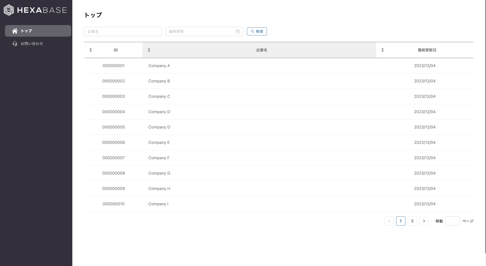

# Hexabase sample-nextjs-contact.

## Summary

This is sample-nextjs-contact application

[https://sample-nextjs-contact.vercel.app/](https://sample-nextjs-contact.vercel.app/)



## Prerequisites

Download and install or execute cmd to install

| name | version        | URL or cmd                      | note |
| :--- | :------------- | ------------------------------- | ---- |
| node | v16.x or later | https://nodejs.org/en/download/ |
| npm  | latest         | $ (sudo) npm install -g npm     |
| yarn | latest         | $ (sudo) npm install -g yarn    |

## User registration to Hexabase and creation your Workspace

- access https://app.hexabase.com/login
- Click `Don't have an account? Signup`
- Select Signup with email address
- After entering the email address of the user you want to register, proceed with authentication from the received email
- After password registration, user registration is completed and your workspace is created

## Download source locally from repository

- `git clone` or download the zip file and extract it locally

## Restore application to workspace created using hexabase-cli

- Access https://github.com/hexabase/hexabase-cli/tree/master
- Execute the following command

```shell
npm install -g hexabase-cli
```

```shell
cd /path/to/project
```

```shell
hx contexts:set prod --server https://api.hexabase.com --sse https://sse.hexabase.com
```

```shell
hx contexts:use prod
```

```shell
hx contexts:login
```

- select your workspace

```shell
hx workspaces:use
```

```shell
hx projects:restore inquiry_template.zip
```

- if there are no problems, the template application will be restored to your workspace

## Create .env according to the created environment

```shell
cp .env.example .env.local
```

### Example

- `NEXT_PUBLIC_PORT=3000` # Set server port
- `NEXT_PUBLIC_API_URL=https://api.hexabase.com/api/v0` # Set api domain
- `NEXT_PUBLIC_WORKSPACE_ID=xxxxxxxxxxxxxxxxxxxxxxxx` # Set workspace ID

See [docs](https://apidoc.hexabase.com/en/docs/v0/applications/GetApplicationsAndDatastores) to get project/database ID

- `NEXT_PUBLIC_PROJECT_ID=xxxxxxxxxxxxxxxxxxxxxxxx` # Set project ID
- `NEXT_PUBLIC_CUSTOMER_DATASTORE_ID=xxxxxxxxxxxxxxxxxxxxxxxx` # Set customer database ID
- `NEXT_PUBLIC_INQUIRY_DATASTORE_ID=xxxxxxxxxxxxxxxxxxxxxxxx` # Set inquiry database ID
- `NEXT_PUBLIC_COMMENT_DATASTORE_ID=xxxxxxxxxxxxxxxxxxxxxxxx` # Set comment database ID

## Getting Started

First, install library:

```bash
yarn
# or
npm install
```

Second, run the development server

```bash
yarn dev
# or
npm run dev
```

Open [http://localhost:3000](http://localhost:3000) with your browser to see the result.

You can start editing the page by modifying `pages/index.tsx`. The page auto-updates as you edit the file.

This project uses [`next/font`](https://nextjs.org/docs/basic-features/font-optimization) to automatically optimize and load Inter, a custom Google Font.

### Directory Structure

```
├── common
│   ├── constants - where to declare canstants
│   ├── form-schemas - where to declare form inputs
│   ├── param-types - where to declare interface
│   ├── libs - where to declare common functions
│   │   ├── i18n - folder multiple languages
│   │   │   ├── locales - where to declare multiple language for project
│   │   │   ├── en
│   │   │   │   ├── common.json
│   │   │   ├── ja
│   │   │   │   ├── common.json
│   │   ├── ${functionName}.ts
├── components - where to declare components that are used in pages
│   ├──${componentName}
│   │   ├── index.tsx
│   │   ├── style.module.scss
├── containers - where to declare containers that surround the components of pages
│   ├──${pageName}
│   │   ├── index.tsx
│   │   ├── style.module.scss
├── hooks - where to declare global states that are used by locations
│   ├── ${hookName}.tsx
├── app - where to declare routes of project
│   ├── [lng] - where to declare router languages
│   │   ├── layout.tsx - A layout is UI that is shared between multiple pages.
│   │   ├── page.tsx - means `/` location
│   │   ├── [folderName]
│   │   │   ├── page.tsx - means `${routeName}` location
├── public - where to declare which are public for clients
│   ├── images
├── services - where to declare which Apis used in project
│   ├── api.ts - where to declare initial api
│   ├── ${apiService}.ts - where to declare api service
├── styles - where to declare css/scss/sass files
│   ├── globals.css
│   ├── ${cssFileName}.scss
├── .dockerignore
├── .env.local
├── .eslintrc.json
├── .gitignore
├── Dockerfile
├── next.config.js
├── next-env.d.ts
├── next-i18next.config.js
├── package.json
├── postcss.config.js
├── README.md
├── tailwind.config.js
├── tsconfig.json
├── yarn.lock
```

## Learn More

To learn more about Next.js, take a look at the following resources:

- [Next.js Documentation](https://nextjs.org/docs) - learn about Next.js features and API.
- [Learn Next.js](https://nextjs.org/learn) - an interactive Next.js tutorial.

You can check out [the Next.js GitHub repository](https://github.com/vercel/next.js/) - your feedback and contributions are welcome!
